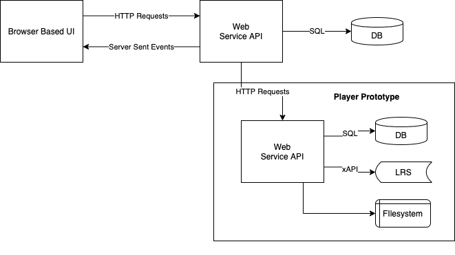

## Running via Docker Compose

After cloning the repository, create a `.env` file in the `cts/` directory. This file needs to include information for the following:

* How to access the LRS to be used for the player *from inside the container*
* The host ports where the CTS and Player can be accessed

For example:

```
HOST_PORT=63399
PLAYER_HOST_PORT=63398
PLAYER_CONTENT_URL=http://localhost:63398/content
PLAYER_KEY=cts
PLAYER_SECRET="an API access secret"
PLAYER_TOKEN_SECRET="some random string"
LRS_ENDPOINT="http://host.docker.internal:8081/20.1.x/lrs/default/"
LRS_USERNAME="dev-tools-xapi"
LRS_PASSWORD="dev-tools-xapi-password"
```

Then run,

    docker-compose up --build -d

To build and run the CTS application. Once run it will be available at the `HOST_PORT` mapped in the `.env` as above.
