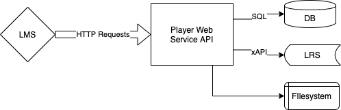

## Running via Docker Compose

After cloning the repository, create a `.env` file in the `player/` directory. This file needs to include information for the following:

* How to access the LRS *from inside the container*
* The host port where the service can be accessed

For example:

```
HOSTNAME=localhost
HOST_PORT=3398

DB_HOST=rdbms
DB_NAME=catapult_player
DB_USERNAME=catapult
DB_PASSWORD=quartz

CONTENT_URL=http://localhost/cmi5/player/content (When using the content url it is either the PLAYER_STANDALONE_LAUNCH_URL_BASE/content or HOSTNAME/HOSTPORT/content)

API_KEY="some API access key"
API_SECRET="an API access secret"
TOKEN_SECRET="some random string"

LRS_ENDPOINT="The LRS endpoint"
LRS_USERNAME="LRS username"
LRS_PASSWORD="LRS password"
LRS_XAPI_VERSION="version if needed
```

Then run,

    docker-compose up --build -d

To build and run the player service. Once run it will be available at the `HOST_PORT` mapped in the `.env` as above.

## Running in a Docker container/network with NGINX server

When running the player as a service behind a docker network or nginx server there are a few extra steps to take. The PLAYER_API_ROOT and PLAYER_STANDALONE_LAUNCH_URL_BASE need to be used. 
```
PLAYER_API_ROOT= "We recommend /cmi5/player here"
PLAYER_STANDALONE_LAUNCH_URL_BASE= "This is the public friendly url"
```

Be sure to add this to the nginx.conf:
```
location /cmi5/player {
    #
    proxy_pass https://"docker container name": :docker port"/cmi5/player;
}
```
This is the internal docker network address.

